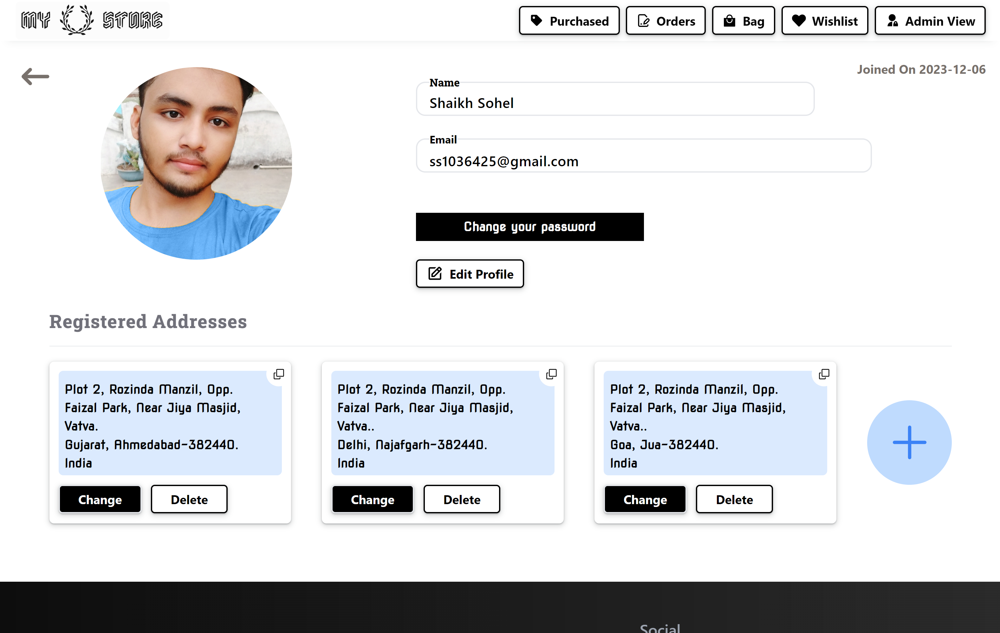
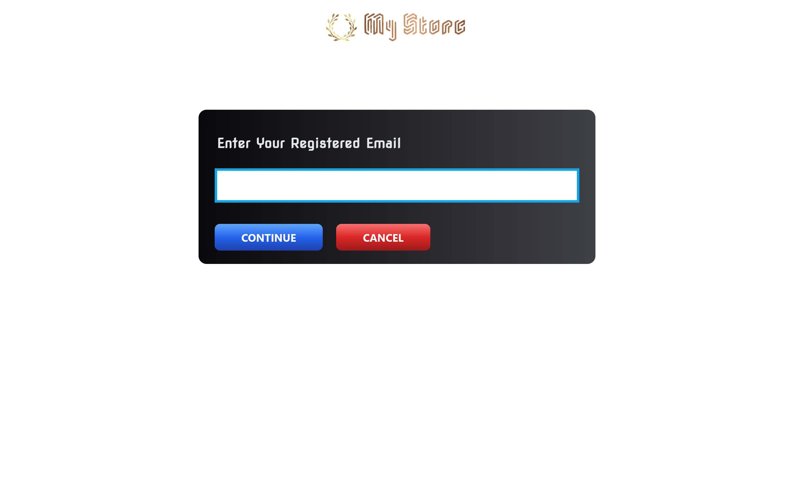
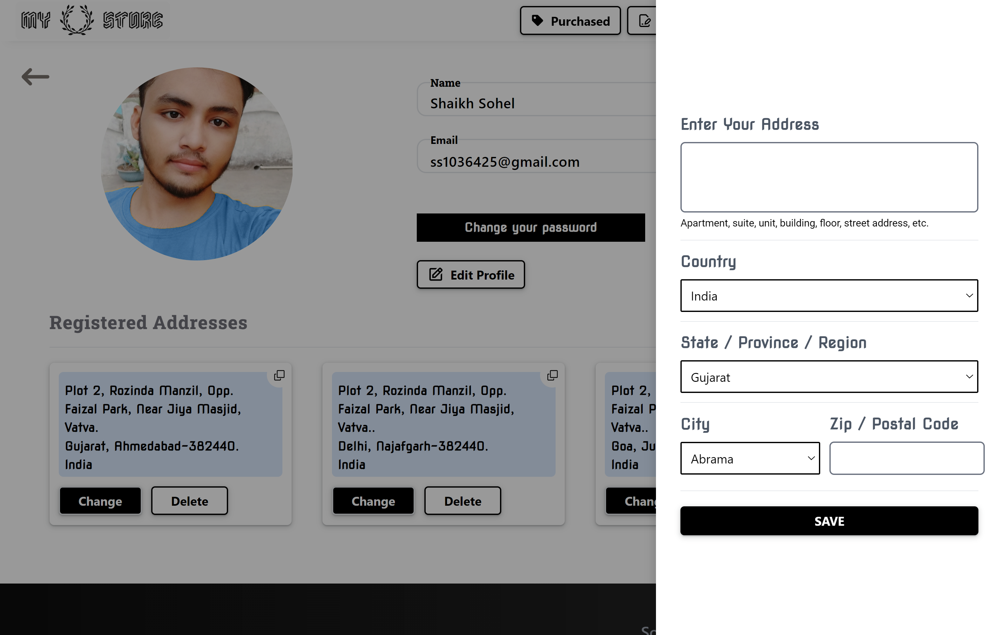
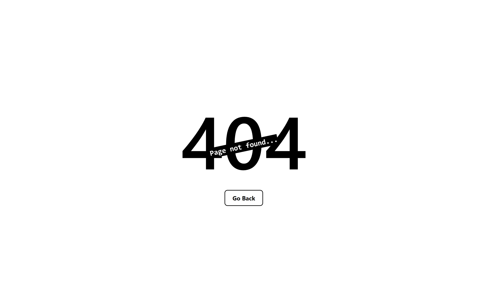

# My Store (MERN Stack Project)

MyStore is an E-commerce App created by me with the collections of ideas gathered from many existing E-commerce Apps, this allows user to buy clothes through a payment gateway (test plan). User can create their profile, update profile, they can change password and even reset the password through a email if forgotten, User can place multiple or single order for multiple or single product with any require quantity, size which is available, user can add products in the wishlist, and user can add, update and delete multiple address, the purchased product history will be available and filter through brand, price and discount is also available at products page and many more..

Along with all the capabilities of user, an Admin can Add, update, and delete products. Admin can view orders and the details of the orders done by users and admin can update the status of the order to delivered, Admin can view history of all deliverd orders and their details.

### Visit the deployed site :

```
    https://mystore-app-react.netlify.app/
```

## Tech Stack

**Client:** React, Tailwind CSS, Redux

**Server:** Node, Express , MongoDB

## Features

**User**

    - Login/SignUp/Logout
    - Create and edit profile, and add, update, delete addresses
    - View orders which are in process
    - Can add, remove products in bag and in wishlist to buy it later
    - Place an order through payment gateway (test plan)
    - Filter products through brand, price and discount
    - Change and reset password

**Admin**

      Along with all the capabilities of USER, Admin can also do,

    - Add/Update/Delete Products
    - View Orders and details of any order which are InProcess and Orders which are Delivered
    - Can update the status of an order from InProcess to Delivered

## Screenshots

- Home Page


- Login


- SignUp


- Products Page


- Product Detail Page


- Bag Page


- Wishlist Page


- Checkout Page


- PaymentGateway


- Payment Success Page


- Payment Failure


- Orders Page


- Order Details


- Purchased Products Page


- Profile Page



- Change Password


- Change Password


- Forgot Password Page



- Reset Password Mail


- Reset Password Page


- Create Modify Address



- Access Denied Page


- Not Found Page



- Not LoggedIn Page


## This Pages are Accessible by ADMIN Only

- Admin Dashboard Page


- Product Entry Page


- Product CRUD Page


- Delivery History Page


## Installation Steps

- ### 1. Clone the Project

  ```
      git clone https://github.com/Sohel-786/myStore.git
  ```

- ### 2. There are two directories, Move into directory name `client`

  ```
      cd client
  ```

- ### & Install dependencies

  ```
      npm i
  ```

- ### 3. Move into directory name `server`

- ### First

       ````
           cd ..
       ````

- ### Second

       ````
           cd server
       ````

- ### & Install dependencies

       ````
           npm i
       ````

* 4.  After Successful Installation of Dependencies for client and server both,
      start the client and server.

---

- **First clone the app in your local machine by running the below command in Git Bash.**

  - Run the Server

  ```
    npm run server
  ```

  - Run the Client, Move into Directory client first

  ```
    cd ..
  ```

  ```
    cd client
  ```

  ```
    npm run dev
  ```

- ## Note for Installation

You Should have your own credentials to run the project on your local machine, you should have `.env` file in the root of `client` folder and in the root of `server` folder also. I will provide structure below for both `.env` files. In that structure i will write what environment variable your `.env` file should have.

- ### .env file in client folder

  ```

  VITE_APP_BASE_URL = http://localhost:5173

  ```

- ### .env file in server folder

  ````

  PORT = 2348
  MONGO_URI = Your MongoDB Connection string
  JWT_SECRET = Your JWT Secret
  FRONTEND_URL = 'http://localhost:5173'
  JWT_EXPIRY = '72h'

  CLOUDINARY_CLOUD_NAME = Your Cloudinary Name - Your can get this credentials from cloudinary
  CLOUDINARY_API_KEY = Your Cloudinary key - Your can get this credentials from cloudinary
  CLOUDINARY_API_SECRET = Your Cloudinary Api Secret - Your can get this credentials from cloudinary

  SMTP_HOST = 'smtp.gmail.com'
  SMTP_PORT = '465'

  SMTP_USERNAME = Your email address from which the emails will be sent to the users of this app (I used fake or temporary Email)

  SMTP_PASSWORD = In Google account of your fake email Enable the two step verification and then you can get this one time password

  SMTP_FROM_EMAIL = Your email address from which the emails will be sent to the users of this app (I used fake or temporary Email)

  STRIPE_API_KEY = your stripe api_key - Your can get this credentials from Stripe

                  ```
                    https://dashboard.stripe.com/test/apikeys
                  ```


  ````

## End Notes

This project is not responsive for the mobile and tablet screen size.
